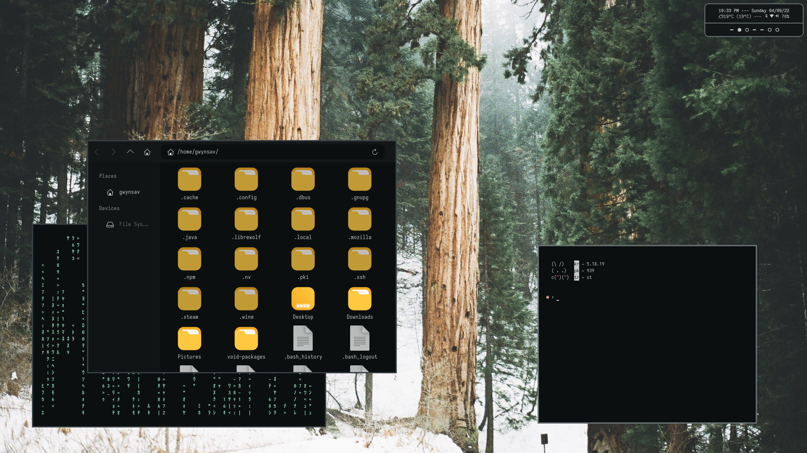

# Welcome
This is a fairly low effort rice that I'm currently working on, it's fairly simple. It just uses a Window Manager (**dk**) and a Notification Daemon (**dunst**) and that's about it.



## Dependencies
### Applications
- **[dk](https://bitbucket.org/natemaia/dk/src/master/)** and **dunst** for obvious reasons.
- **hsetroot* for Wallpaper setter.
- **bluez** and **iwd** for Bluetooth and Networking respectively.
- **alsa-utils** and **playerctl** for Sound and Music.
- **curl** and **jq** for cropping the Weather information.
- **rofi** as an Application Launcher and also a Powermenu.
- You may also optionally want **Neovim** and **ranger**, and **Thunar**.

### Fonts and Icons
- **Sarasa Mono** and **[VictorMono Nerd Font](https://github.com/ryanoasis/nerd-fonts/tree/master/patched-fonts/VictorMono)** for the display fonts.
- **Material Icons** for the icons font (for the most part).
- **[Reversal Dark](https://github.com/yeyushengfan258/Reversal-icon-theme)** for the GTK/rofi icons.
- **[kizu's phocus](https://github.com/janleigh/gtk3)** for the GTK theme.

## Installation
Install the dependencies, most of which are in official repos for most distros.

For **Arch**:
```
# pacman -S dunst hsetroot bluez bluez-utils iwd alsa-utils playerctl curl jq rofi ttf-sarasa-gothic nodejs-material-design-icons
```
For **Void**:
```
# xbps-install -S dunst hsetroot bluez iwd alsa-utils playerctl curl jq rofi font-sarasa-gothic font-material-design-icons-ttf
```
dk is not packaged, and therefore must be built from source. Go to dk's repo, install its dependencies, and then clone and build the program.
```
## For Arch
# pacman -S xcb-proto xcb-util xcb-util-wm xcb-util-cursor xcb-util-keysyms 
## For Void
# xbps-install -S xcb-proto xcb-util-devel xcb-util-wm-devel xcb-util-cursor-devel xcb-util-keysyms-devel 

$ git clone https://bitbucket.org/natemaia/dk.git
$ make
# make install
```
Then just add `dbus-run-session dk` to your `.xinitrc` file.
You should also install **VictorMono Nerd Font** to `/usr/share/fonts` and run `fc-cache -vf`, and **Reversal Dark** icons to `.local/share/icons`(used in the scripts) or `/usr/share/icons/`. You can also install **kizu's GTK theme**, as it uses the same color palette as the rest of the rice.

After all of that is done, the files in this repo just go in your homedir and that's it.
